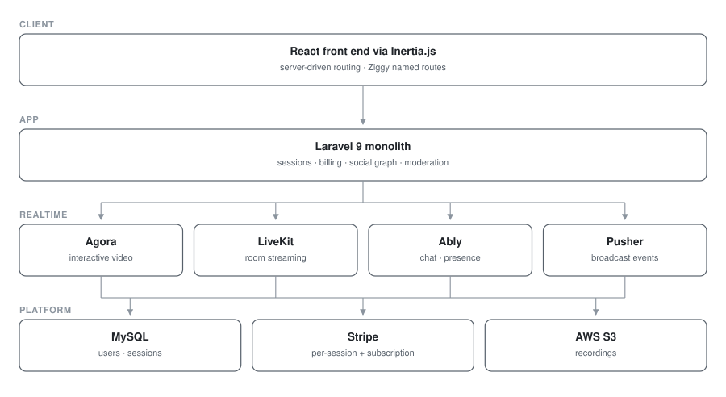

# Stream-It — Live Streaming Platform

**Live streaming · Laravel 9 + React · Agora + LiveKit**

Paid live video sessions with real-time chat, follows and scheduling — two video providers and two realtime transports integrated side by side.

> **Source code is private.** This repository documents the architecture and engineering work.

## My role
Full-stack engineer

## Engineering highlights

**Video infrastructure.** Two providers integrated side by side — Agora (`agora-rtc-sdk-ng`, `agora-react-uikit`) for low-latency interactive sessions and LiveKit (`agence104/livekit-server-sdk`) for scalable room-based streaming — with server-issued JWTs (`firebase/php-jwt`) gating room access.

**Real-time messaging.** Ably for chat and presence, Pusher for server-side broadcast events, both bridged into React through Laravel Echo.

**Inertia architecture.** Laravel 9 + Inertia.js + React — server-driven routing with a full SPA feel and no separate API layer to maintain, with Ziggy exposing named routes to the client.

**Payments.** Stripe Elements (`@stripe/react-stripe-js`) for per-session and subscription billing.

**Social graph.** `overtrue/laravel-follow` for follower relationships driving notifications and discovery feeds.

**Security.** `mews/purifier` and `sanitize-html-react` sanitise user-generated content on both ends; reCAPTCHA v3 for bot mitigation.

**Scheduling.** Time-range pickers for booking streams, with S3-backed recording storage.

## Architecture

## Screenshots

<!--  -->
<!--  -->
<!--  -->

_Screenshots pending — see `docs/README.md`._

## Stack

`Laravel 9` · `React` · `Inertia.js` · `Agora` · `LiveKit` · `Ably` · `Pusher` · `Stripe` · `AWS S3` · `MySQL`
